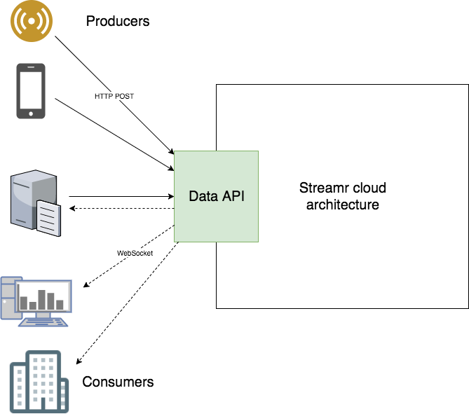

# Data API

An essential service of the Streamr cloud architecture responsible for inbound and outbound data to/from Streamr
cloud. Provides HTTP and WebSocket APIs for producing data to and listening to data from Streamr. All external and 3rd
party data communication with Streamr flows through this service.



## Building
Project uses npm for package management.

- Start off by installing required dependencies with `npm install`
- To run tests `npm test`

## Running
In most cases, you will want to run this service as a [pre-built Docker image](https://hub.docker.com/r/streamr/data-api/).
See https://github.com/streamr-dev/streamr-docker-dev for more information on how to run the Streamr cloud architecture.

If you are developing this service in particular, or are otherwise inclined, you can run this service with `npm run`.

## Publishing
A [Docker image](https://hub.docker.com/r/streamr/data-api/) is automatically built and pushed to DockerHub when commits
are pushed to branch `master`.

Currently project has no CI system configured nor are any packages published to npmjs.com. 

## API Specification

For production version refer to https://www.streamr.com/help/api#datainput and https://www.streamr.com/help/api#dataoutput.

Otherwise see [APIDOC.md](APIDOC.md)

## Protocol

**PLEASE BE ADVISED: Below may be outdated!**

### Requests sent by client

Also see the [Javascript client](https://github.com/streamr-dev/streamr-client) documentation.

#### subscribe

Requests that the client be subscribed to a stream-partition from the next published message. Will result in a `subscribed` message, and a stream of `broadcast` messages as they are published.

```
{
  "type": "subscribe",
  "stream": "streamId",
  "partition": 0,         // optional, defaults to 0
  "authKey": "authKey"    // optional, defaults to undefined
}
```

Field     | Description
--------- | --------
type      | Always "subscribe"
stream    | Stream id to subscribe to
partition | Partition number to subscribe to. Optional, defaults to 0
authKey   | User API key or anonymous stream key. Optional. Public streams can be subscribed to without authentication.

#### unsubscribe

Unsubscribes the client from a stream-partition. The response message is `unsubscribed`.

```
{
  "type": "unsubscribe",
  "stream": "id",
  "partition": 0          // optional, defaults to 0
}
```

Field     | Description
--------- | --------
type      | Always "unsubscribe"
stream    | Stream id to unsubscribe
partition | Partition number to unsubscribe. Optional, defaults to 0

#### resend

Requests a resend for a stream-partition. Responses are either a sequence of a `resending`, one or more `u`, and a `resent`; or a `no_resend` if there is nothing to resend.

```
{
  "type": "resend",
  "stream": "id",
  "partition": 0          // optional, defaults to 0
  "sub": "subId",
  // one of: "resend_all": true, "resend_last": (number), "resend_from": (offset)
}
```

Field     | Description
--------- | --------
type       | Always "unsubscribe"
stream     | Stream id to unsubscribe
partition  | Partition number to unsubscribe. Optional, defaults to 0
resend_all | Set to true to resend all messages in stream
resend_last| Resend the latest N messages
resend_from| Resend all messages from and including the given offset. Can be used in combination with `resend_to`
resend_to  | Resend up to given offset

### Responses sent by server

Messages sent by the server are arrays with the following structure:

`[messageVersion, messageType, subId || "", messagePayload]`

- `messageVersion` is 0 for all messages.
- `messageType` identifies the message type as follows:

messageType | Description
----------- | -----------
0 | broadcast
1 | unicast
2 | subscribed
3 | unsubscribed
4 | resending
5 | resent
6 | no resend
7 | error

- `subId` is non-empty on `unicast` messages and identifies the subscription by id
- `messagePayload` is the message payload as described below.

#### broadcast (0)

A message addressed to all subscriptions listening on the stream. The message payload is a an event in a stream, wrapped in a header array as follows:

`[version (28), streamId, streamPartition, timestamp, ttl, offset, previousOffset, contentType, streamEvent]`

- `version` is currently 28
- `streamId` what stream this message belongs to
- `streamPartition` what stream partition this message belongs to
- `timestamp` of the message (milliseconds format)
- `ttl` time-to-live of the message in seconds
- `offset` is an increasing number that can be used for message ordering and gap detection
- `previousOffset` is the `offset` of the previous message, used for gap detection
- `contentType` determines how `streamEvent` should be parsed:

contentType | Description
----------- | -----------
27          | `streamEvent` should be parsed as JSON

#### unicast (1)

Unicast messages have non-empty `subId`. Content is just like in the broadcast message.

#### subscribed (2)

Sent in response to a `subscribe` request. Lets the client know that streams were subscribed to.

```
{
  "stream": "id",
  "partition": 0
}
```

#### unsubscribed (3)

Sent in response to an `unsubscribe` request.

```
{
  "stream": "id",
  "partition": 0
}
```

#### resending (4)

Sent in response to a `resend` request. Informs the client that a resend is starting.

```
{
  "stream": "id",
  "partition": 0
}
```

#### resent (5)

Informs the client that a resend for a particular subscription `subId` is complete.

```
{
  "stream": "id",
  "partition": 0
}
```

#### no resend (6)

Sent in response to a `resend` request. Informs the client that there was nothing to resend.

```
{
  "stream": "id",
  "partition": 0
}
```

### Events emitted on server instance

Event     | Arguments | Description
--------- | -------- |  ----
`stream-object-created` | Stream | Emitted when a Stream reference object is created
`stream-object-deleted` | Stream | Emitted when a Stream reference object is deleted

